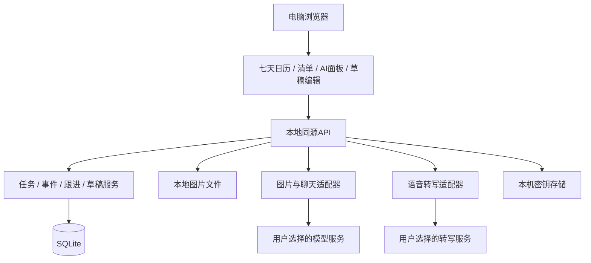

# 架构设计 v0.1

日期：2026-09-21。本文保留开发前设计；首版现已实现，具体落地差异和验证结果见 [验证记录](./VERIFICATION.md)。以PRD已确认行为为产品约束；此文补齐实现决策，不扩大产品范围。

## 1. 决策摘要

采用**本地模块化单体**：一个本地服务承载静态网页、业务API、AI调用和SQLite数据访问。网页是交互入口；模型是可替换的理解服务；业务规则和持久记录不依赖模型记忆。

| 层 | 建议方案 | 原因 |
|---|---|---|
| 交互 | React、TypeScript、Vite | 面板、草稿表单和日历共享类型；构建成静态文件，不需要SSR |
| 日历 | 自定义七列时间网格 + 封装的拖动控制器 | 直接满足任意起日、30分钟隐形吸附及跨周拖动；不把核心交互绑定到商业日历许可 |
| 服务 | Node.js、TypeScript、Fastify | 同一语言，单进程，路由校验与服务模块分离 |
| 存储 | SQLite + 版本化SQL迁移 | 单人本地持久化、事务、便携备份；无独立数据库服务器 |
| AI | 图片／聊天适配器 | 首版支持明确的一种兼容协议；具体服务能力连接测试 |
| 语音 | 独立TranscriptionAdapter | 图片聊天模型和语音接口可能不同，分别配置与测试 |
| 启动 | Windows快捷方式 + 隐藏启动脚本 | 检查服务、启动、打开本地网页，不要求用户操作终端 |

不引入微服务、Redis、向量数据库、容器编排、多智能体运行框架或自建用户系统。日程和相关对话通过任务ID准确加载，首版不需要语义检索基础设施。依赖精确版本及SQLite驱动在技术验证时锁定，不在设计文档中把未测试版本写成已兼容。

## 2. 组件关系



GitHub不在运行链路中；Codex也不在产品运行链路中。开发者维护代码，最终用户通过网页使用AI。未来可以添加受控工具接口供外部助手访问，但首版无需实现。

## 3. 模块划分与建议目录

以下为未来实现目录，当前仓库只含设计文档。

```text
apps/web/src/
  calendar/       七天窗口、布局、拖动、坐标换算
  tasks/          项目、任务清单、详情
  assistant/      对话、图片、录音、草稿核对
  followups/      站内跟进卡片
  settings/       模型、备份、时区
apps/server/src/
  routes/        HTTP输入输出
  domain/        不依赖UI和模型的业务规则
  drafts/        草稿版本、验证、采用
  providers/     ChatVisionAdapter / TranscriptionAdapter
  storage/       SQLite仓储、迁移、附件与备份
  security/      本地会话、凭证访问、日志脱敏
packages/contracts/  API字段、运行时schema及错误码
tests/               规则与端到端流程测试
scripts/             Windows启动与打包
docs/                PRD引用、架构与验收文档
```

界面不直接操作数据库；路由不直接调用SQL绕过业务服务；AI输出不能执行SQL或调用任意本机命令。

## 4. 数据模型

| 实体 | 核心字段与约束 |
|---|---|
| projects | id、title、category、description、version |
| tasks | project_id可空、title、status、due_date或due_at、日期精度、缺失字段、progress、version；没有确定截止时间也允许存在 |
| task_blocks | task_id、start_at、end_at、timezone、待确认／完成／未完成状态；同一任务历史可有多个安排 |
| event_series | 固定事件标题、本地开始时间、结束时间、星期规则、学期起止日期、timezone、version |
| event_exceptions | series_id、原发生日期、跳过或覆盖字段；仅影响一次，不改整个系列 |
| followups | task_id、next_at、待处理／延后／关闭状态、原因、缺失字段、context_summary；不是工作时段 |
| conversations / messages | 本地对话、文字、附件引用、关联task_id；不保存密钥 |
| attachments | id、生成文件名、MIME、大小、hash、来源信息；文件独立保存 |
| drafts / draft_items | 草稿版本、操作类型、目标及其版本、用户编辑值、来源、校验错误、采用状态 |
| mutations | 操作ID、幂等键、涉及对象、前后版本、逆操作信息；支持一致撤销 |
| provider_configs | 能力类型、服务地址、模型、credential_ref；密钥单独存放 |
| settings | 时区、日历视图偏好、schema_version |

时间段使用半开区间[start,end)，因此10:00结束与10:00开始不冲突。截止日期不占用时间段。只有日期的截止信息不转换成虚构的23:59；明确日期时间保存时区并转换到统一时间基准。每周课程按本地日期和时区生成，不按UTC固定间隔粗略加七天。

固定事件到期不要求确认；任务工作时间块到期才进入待确认。跟进提醒又是独立状态，不与任务截止混用。固定事件可以独立存在，不需为了显示课程强造待办。

## 5. AI闭环与采用协议

1. 用户提交文本或图片，服务保存消息及附件引用。
2. 服务构造上下文：当前日期／时区、相关任务、用户选择的日期窗口、此前缺失信息；不默认发送完整数据库。
3. ChatVisionAdapter请求模型，返回解释、澄清问题和候选结构化操作。模型没有网络搜索、shell、数据库写入能力。
4. 对候选操作进行schema校验、日期精度检查、重复候选检查；无法解析时保留原回答并提供重试，不生成虚假成功结果。
5. 保存可编辑草稿。图片原文、模型推测及缺失信息可核对；正式日历不变。
6. 用户编辑或通过对话要求修订。草稿版本递增；迟到的模型响应不得覆盖更新过的用户值。
7. 用户点采用，发送draft_id、draft_version、选中条目及idempotency_key。
8. 服务在事务内核对草稿版本和目标实体版本、重新检查当前日历冲突、写入所选变更及逆操作记录，标记采用成功。
9. UI收到成功结果才更新正式数据；失败在草稿中标明问题，保持可编辑。

所有AI新增、修改、删除都走草稿；普通鼠标拖动是用户直接操作，可通过业务命令立即保存，不再强制生成AI草稿。

一次采用的所选条目整体成功或整体回滚；若一条有问题，用户修正或取消选择后再采用，不能静默漏掉某条。重复点击返回同一结果。撤销也检查版本，如后续已有修改则说明冲突，不盲目覆盖。

## 6. 日历与重复规则

- 视图由startDate加七天定义；列号只用于显示，写入必须使用真实日期。
- 默认08—24点，允许纵向滚动；只有整点文字刻度。半小时吸附发生在拖动坐标换算中，不增加半点标签。
- 精确录入09:15时按比例显示，不能取整；用户主动拖动后按30分钟网格预览，松手前显示新时间。
- 拖动期间只更新预览，释放有效位置才发保存命令；本地快速检测后服务器最终验证。
- 固定事件按查询范围展开实例；创建或修改重复课程时检查整个有限学期内的冲突，不只检查当前七天。
- 修改重复事件时区分仅本次和本次及以后。后者拆分系列，保留过去历史。
- 切换日期窗口不能把拖动状态当作已保存。无效落点灰色叉号，有效蓝色；按Escape取消可作为键盘辅助。
- 小屏宽度下仍保持七列语义，收起侧栏及纵向滚动，不实现手机布局。

**待原型验证的交互**：小时纵向滚动到边界后继续滚动平移日期，拖动左右边缘平移日期、上下边缘滚动小时。需阈值和停顿防误触；同时提供按天导航。具体手势可能调整，连续七天与跨周拖动不能删减。

## 7. 跟进与当前时间

用户说“过几天提醒”，AI先给出明确日期时间供核对，采用后保存followup。任务资料、来源、缺失字段和讨论摘要跟随记录保存，不依赖聊天上下文永久可用。

网页打开时定期（建议30秒）读取当前时钟检查状态；打开、恢复焦点时立即检查。提醒由确定性查询产生，不为每次检查调用模型。已到期卡片按记录ID去重；点击继续讨论才加载任务上下文并请求AI。

网页关闭后不提醒，无提醒常驻或系统通知；下次打开补显示待跟进。记录不会因关闭而丢失。页面刷新时不重复生成卡片。应用读取系统日期时间，无学习计时器；默认系统校时，由用户在设置中确认应用时区。

## 8. 语音转文字

浏览器录音只是采集入口，不把浏览器内置语音识别作为唯一依赖。建议使用MediaRecorder采集，音频格式支持、时长上限和服务接收格式在验证时确定；首版建议每段最多2分钟，界面明确限制。

流程：请求麦克风权限→开始／取消／停止→提交TranscriptionAdapter→可编辑转写草稿→用户点发送。转写文字不得直接采用任务。

转写服务可与图片聊天服务不同；设置分别支持endpoint、model、credential_ref，可在相同服务下复用凭证引用。测试文字、图片、转写三个能力，不能以“Key有效”代替实际能力验证。默认不永久存储录音，上传临时文件在成功、取消、失败清理策略中统一管理。

暂未选择具体提供方，因此费用、数据保留及地域行为不能提前承诺；配置界面应标明音频发送目标。无语音配置时文字和图片日程管理仍可用，但交付完整首版前必须完成有效转写配置下的真实测试。

## 9. 本机运行、安全和备份

- 构建后由同一服务提供前端和API，默认绑定127.0.0.1；启用lan:enabled后监听0.0.0.0，仅接受本机与实际私网地址Host。非回环请求必须持有配对授权Cookie，所有数据API（含图片和session）均鉴权；一次性配对码限时、限尝试次数，设备可撤销。开发端口配置另行管理。
- 写操作和AI费用操作要求本地会话及来源校验；拒绝任意跨域请求。禁止把凭证放在URL或前端静态资源中。
- 密钥通过专用接口设置，响应仅返回遮罩和配置状态；建议用Windows DPAPI用户范围保护，启动读取交给凭证模块。实现可用性需技术验证，不以base64充当加密。
- 模型服务地址由用户在设置中配置；模型输出不能更改地址或请求任意URL。正常远程服务要求HTTPS；本地模型地址可显式配置。
- 图片实际类型、体积、像素与路径均校验；以生成ID命名，防止路径穿越。上传大小限制在实现验证后公布，不猜测模型无限支持。
- 数据默认位于用户本机应用数据目录，独立于仓库。凭证、日程、图片、录音、对话和日志不入Git。
- SQLite操作通过事务及迁移管理。备份使用一致快照／backup机制，不直接复制正在写入的db文件。附件清单与数据快照一起备份，密钥排除。
- 恢复前校验格式、版本、附件清单，并创建恢复前备份；恢复失败不破坏现有数据。迁移前备份，测试旧版本升级。
- 日志只记录错误码、耗时、请求ID等诊断信息，默认不记录Key、原图片或完整聊天。
- 快捷方式先探测应用健康及实例身份，再启动隐藏进程并打开浏览器；避免重复实例。初版可由本地服务承载运行，但无关闭网页后提醒职责。退出服务入口及停止方式需提供。

## 10. 最小API边界（设计契约）

| API | 用途 |
|---|---|
| GET /api/calendar?start=&days=7 | 固定事件实例、任务时间块及版本 |
| GET /api/tasks | 按未完成、截止日期、项目筛选 |
| POST /api/commands | 用户手工创建、拖动、完成、退回、撤销；白名单命令 |
| POST /api/attachments | 上传并返回来源引用 |
| POST /api/conversations/:id/messages | 请求AI理解，返回解释及草稿引用；可流式显示文字 |
| PATCH /api/drafts/:id | 保存用户编辑，校验版本 |
| POST /api/drafts/:id/apply | 明确采用，事务及幂等处理 |
| GET /api/followups?due=now | 当前到期待跟进 |
| POST /api/transcriptions | 音频转写为文本，不修改日程 |
| PUT /api/providers/:id | 修改配置／设置凭证，返回脱敏状态 |
| POST /api/providers/:id/test | 测试指定能力，显示真实失败原因 |
| POST /api/backups / POST /api/restore | 一致备份及可恢复导入 |

错误应区分VALIDATION、CONFLICT、STALE_VERSION、PROVIDER_UNAVAILABLE、UNSUPPORTED_CAPABILITY和STORAGE_FAILURE，让UI显示可行动的处理方式。

## 11. 主要风险与验证顺序

1. 用户所选模型的图片和语音能力不确定：先用真实请求验证，各能力独立配置。
2. 连续七天纵向跨日期的手势易误触：先做空数据交互原型验证，不冒充产品已完成。
3. 日期含糊、重复课程例外、旧草稿覆盖新数据：确定性测试覆盖，先完成数据和命令边界再接模型。
4. Windows启动、凭证保护和SQLite驱动安装可能增加部署成本：在实现早期做干净机器启动演练。

## 12. 技术依据

以下为2026-09-21查阅的官方资料；用于选型依据，项目尚未安装或验证具体版本。

- [React：从头构建应用与Vite方案](https://react.dev/learn/build-a-react-app-from-scratch)
- [Fastify：TypeScript](https://fastify.dev/docs/latest/Reference/TypeScript/)
- [Fastify：验证与序列化](https://fastify.dev/docs/latest/Reference/Validation-and-Serialization/)
- [SQLite：事务隔离](https://www.sqlite.org/isolation.html)
- [SQLite：WAL与文件一致性](https://www.sqlite.org/wal.html)

## SQL执行与学习数据

`server/sql-content.ts`维护示例数据、题目、分步提示和参考查询；公开接口排除参考答案。`sql-worker.ts`在独立Node子进程内重建内存数据库，用SQLite authorizer仅允许读取与指定常用函数，禁止写入、ATTACH、PRAGMA和扩展加载。`sql-runner.ts`限定执行时间及输出体积。两组数据做结果检查；不是对任意数据的正确性证明。

`sql-routes.ts`提供学习状态、代码保存、运行/提交、提示与AI教练。学习数据存于SQLite的独立`sql:learning`条目，包含题目代码、提示计数、最多500条运行记录和教练反馈，并纳入备份。恢复时使用Zod校验。学习记录不参与日程撤销历史。

前端`SqlWorkspace.tsx`独立承载题目、查询编辑、结果、记录、数据字典和提示。离开SQL页时保持组件状态；SQL后台读取失败会显示错误。教练只负责提示，判题来自隔离执行器。

跨端读取在打开、切回前台和恢复联网时触发，不定时轮询，学习数据用内容摘要触发刷新，UI不覆盖正在输入的对话。授权Cookie仅服务器保存哈希，HttpOnly/SameSite=Strict；局域网HTTP不作为外网或不可信网络方案。


## 云端运行模式

PLANNER_CLOUD=1 启用独立密码登录、HTTPS Secure Cookie及AES-GCM模型凭证保护；不使用LAN本机免认证。SQLite与图片保存在持久卷，单实例运行。部署、迁移及当前同步限制见 CLOUD-DEPLOYMENT.md。
